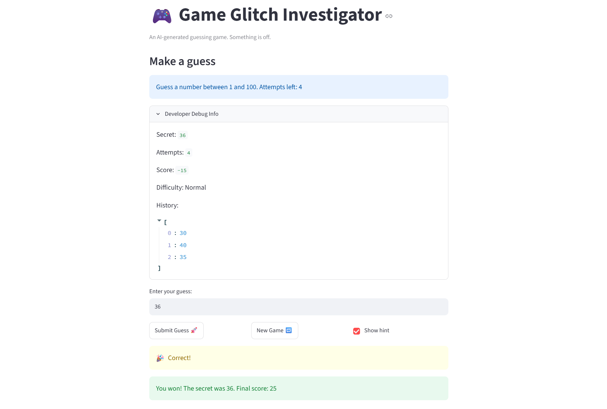

# 🎮 Game Glitch Investigator: The Impossible Guesser

## 🚨 The Situation

You asked an AI to build a simple "Number Guessing Game" using Streamlit.
It wrote the code, ran away, and now the game is unplayable. 

- You can't win.
- The hints lie to you.
- The secret number seems to have commitment issues.

## 🛠️ Setup

1. Install dependencies: `pip install -r requirements.txt`
2. Run the broken app: `python -m streamlit run app.py`

## 🕵️‍♂️ Your Mission

1. **Play the game.** Open the "Developer Debug Info" tab in the app to see the secret number. Try to win.
2. **Find the State Bug.** Why does the secret number change every time you click "Submit"? Ask ChatGPT: *"How do I keep a variable from resetting in Streamlit when I click a button?"*
3. **Fix the Logic.** The hints ("Higher/Lower") are wrong. Fix them.
4. **Refactor & Test.** - Move the logic into `logic_utils.py`.
   - Run `pytest` in your terminal.
   - Keep fixing until all tests pass!

## 📝 Document Your Experience

- [ ] Describe the game's purpose.
- [ ] Detail which bugs you found.
- [ ] Explain what fixes you applied.

## 📸 Demo Walkthrough

Describe your fixed game in numbered steps so a reader can follow along without watching a video:

1. User enters a guess of 40, game hints the number is "Too Low"
2. User enters a guess of 70, game hints the number is "Too High"
3. Score updates correctly after each guess, with a higher score the faster the user guesses the correct number
4. Game ends after the correct guess
5. User can press New Game button to play again

**Screenshot** *(optional)*: 


## 🧪 Test Results

Run from `tests/test_game_logic.py` using GitHub Actions. [Workflow Link](https://github.com/iyim4/ai110-module1show-gameglitchinvestigator-starter/actions).

```
============================= test session starts ==============================
platform linux -- Python 3.11.15, pytest-9.1.0, pluggy-1.6.0 -- /opt/hostedtoolcache/Python/3.11.15/x64/bin/python
cachedir: .pytest_cache
rootdir: /home/runner/work/ai110-module1show-gameglitchinvestigator-starter/ai110-module1show-gameglitchinvestigator-starter
configfile: pytest.ini
plugins: anyio-4.14.0
collecting ... collected 41 items

tests/test_game_logic.py::test_winning_guess PASSED                      [  2%]
tests/test_game_logic.py::test_guess_too_high PASSED                     [  4%]
tests/test_game_logic.py::test_guess_too_low PASSED                      [  7%]
tests/test_game_logic.py::test_easy_difficulty_range PASSED              [  9%]
tests/test_game_logic.py::test_normal_difficulty_range PASSED            [ 12%]
tests/test_game_logic.py::test_hard_difficulty_range PASSED              [ 14%]
tests/test_game_logic.py::test_invalid_difficulty_defaults_to_normal PASSED [ 17%]
tests/test_game_logic.py::test_parse_valid_integer PASSED                [ 19%]
tests/test_game_logic.py::test_parse_valid_float PASSED                  [ 21%]
tests/test_game_logic.py::test_parse_empty_string PASSED                 [ 24%]
tests/test_game_logic.py::test_parse_non_numeric PASSED                  [ 26%]
tests/test_game_logic.py::test_update_score_win PASSED                   [ 29%]
tests/test_game_logic.py::test_update_score_too_high_even_attempt PASSED [ 31%]
tests/test_game_logic.py::test_update_score_too_low PASSED               [ 34%]
tests/test_game_logic.py::test_update_score_none_outcome PASSED          [ 36%]
tests/test_game_logic.py::test_update_score_invalid_outcome PASSED       [ 39%]
tests/test_game_logic.py::test_check_guess_with_negative_numbers PASSED  [ 41%]
tests/test_game_logic.py::test_check_guess_with_zero PASSED              [ 43%]
tests/test_game_logic.py::test_check_guess_negative_vs_positive PASSED   [ 46%]
tests/test_game_logic.py::test_check_guess_with_very_large_numbers PASSED [ 48%]
tests/test_game_logic.py::test_check_guess_string_inputs PASSED          [ 51%]
tests/test_game_logic.py::test_check_guess_mixed_inputs_1 PASSED         [ 53%]
tests/test_game_logic.py::test_check_guess_mixed_inputs_2 PASSED         [ 56%]
tests/test_game_logic.py::test_difficulty_case_sensitivity PASSED        [ 58%]
tests/test_game_logic.py::test_difficulty_empty_string PASSED            [ 60%]
tests/test_game_logic.py::test_difficulty_with_whitespace PASSED         [ 63%]
tests/test_game_logic.py::test_parse_negative_number PASSED              [ 65%]
tests/test_game_logic.py::test_parse_negative_float PASSED               [ 68%]
tests/test_game_logic.py::test_parse_zero PASSED                         [ 70%]
tests/test_game_logic.py::test_parse_very_large_number PASSED            [ 73%]
tests/test_game_logic.py::test_parse_leading_trailing_whitespace PASSED  [ 75%]
tests/test_game_logic.py::test_parse_multiple_decimals PASSED            [ 78%]
tests/test_game_logic.py::test_parse_just_decimal_point PASSED           [ 80%]
tests/test_game_logic.py::test_parse_scientific_notation PASSED          [ 82%]
tests/test_game_logic.py::test_update_score_high_attempt_number PASSED   [ 85%]
tests/test_game_logic.py::test_update_score_zero_attempt PASSED          [ 87%]
tests/test_game_logic.py::test_update_score_negative_current_score PASSED [ 90%]
tests/test_game_logic.py::test_update_score_too_high_odd_attempt PASSED  [ 92%]
tests/test_game_logic.py::test_update_score_negative_attempt_number PASSED [ 95%]
tests/test_game_logic.py::test_update_score_outcome_case_sensitivity PASSED [ 97%]
tests/test_game_logic.py::test_update_score_very_negative_final_score PASSED [100%]

============================== 41 passed in 0.06s ==============================
```

## 🚀 Stretch Features

- Challenge 1: Advanced Edge-Case Testing. Added 38 more testcases, including edgecases.
